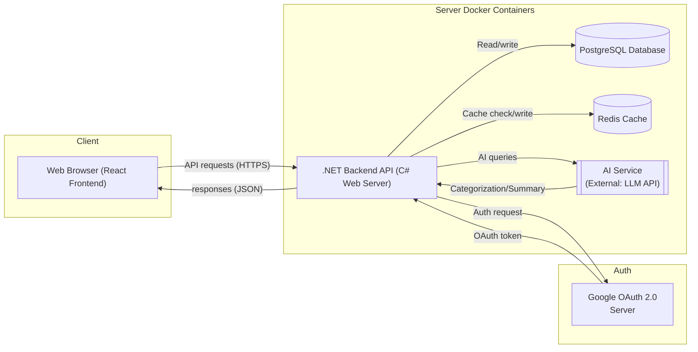
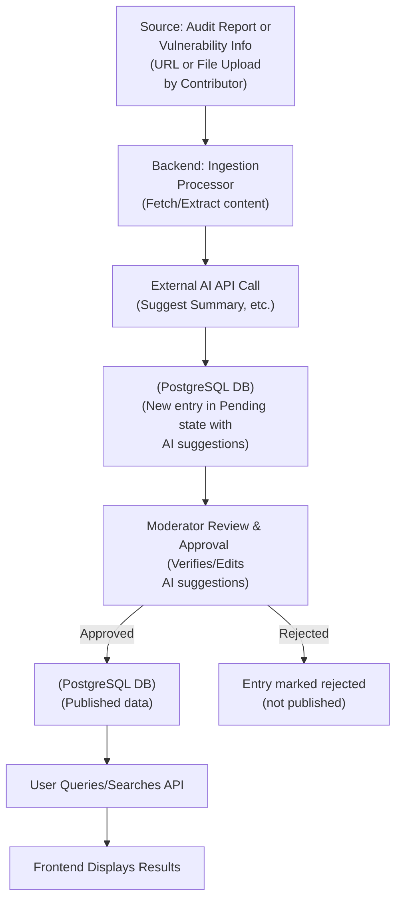
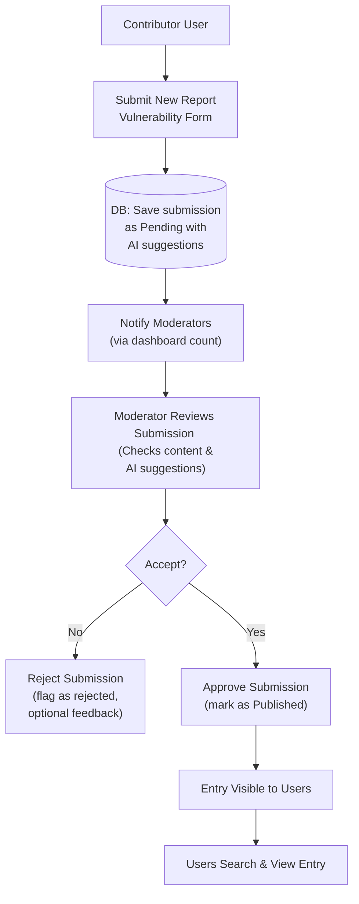

# Stellar Soroban Security Catalogue

## Introduction and Purpose

The Soroban Security Catalogue (`SSC`) is an open-source, community-driven web application that aggregates security audit reports, vulnerability analyses, and related data for the Soroban smart contract ecosystem.
Soroban – Stellar’s smart contract platform – is relatively new, and sharing security findings is critical to foster secure development practices. `SSC` purpose is to centralize Soroban vulnerability information from various sources (audit firms, independent researchers, community reports) into one searchable repository. Doing so enables developers, auditors, and the community to learn from past vulnerabilities, understand common pitfalls, and adopt best practices for secure Soroban development. 

> `SSC` will be developed over an initial **3-month timeline** to deliver a MVP, leveraging established technologies to accelerate implementation.

Key goals and features for the MVP include:
- Centralized Vulnerability Database: Aggregate Soroban audit reports and discovered vulnerabilities into a single repository with a consistent format and taxonomy. Users can search and browse vulnerabilities across all Soroban projects instead of scouring disparate sources.
- Moderated Community Submissions: Encourage community contributions of new findings or reports while ensuring data integrity through moderation. Submissions from users (e.g., auditors, developers) are reviewed by moderators before publication, preventing spam or false data. This maintains high-quality, trustworthy information.
- Effective Filtering & Classification: Provide useful search and filter capabilities – e.g., filter vulnerabilities by severity (Critical, High, Medium, Low), type/category, affected project, and date. Each vulnerability entry is classified with metadata to support filtering and sorting.
- Knowledge Sharing & Best Practices: `SSC` educates the community and promotes secure coding practices by openly sharing verified Soroban security issues and fixes. This community-driven approach empowers security professionals and developers to exchange information about vulnerabilities and better understand their impact. The focus on promoting security best practices aligns with Soroban’s design philosophy and helps set high security standards for the ecosystem.

In summary, `SSC` acts as a “one-stop” knowledge base for Soroban smart contract security. The following sections describe the system’s architecture and how system components work together to achieve the above goals for an MVP.

## System Architecture Overview

`SSC` follows a modular client-server architecture with containerized services. The major components are: a React web front-end, a C# .NET back-end API, a PostgreSQL database (with pgvector plugin) for persistent storage, a Redis in-memory store for caching, and AI integration for assisting with reasonably addressed tasks (such as classification). User authentication is handled via both Google SSO (OAuth 2.0 login) and traditional email/password, with role-based access control to manage permissions (roles for admins, moderators, contributors, viewers). All core components are Dockerized into separate services, enabling easy deployment and scalability. At a high level, end-users interact with the React front-end in their browser, which communicates with the .NET back-end via HTTPS REST API calls. The back-end contains the application logic: serving content from the PostgreSQL database, handling new submissions, performing authentication, and orchestrating background tasks like AI analysis. PostgreSQL stores structured data about vulnerabilities, reports, and users, while Redis caches frequently used data to improve read performance and vectorized information as embeddings from reports. The AI functionality (integrated via external APIs like OpenAI) helps auto-categorize or summarize vulnerabilities to assist moderators and users, generate embeddings. The diagram below illustrates the high-level architecture and interactions between these services:



**Service interaction summary:** A user’s browser (frontend) communicates with the .NET API for all operations (searching vulnerabilities, submitting reports, managing accounts, etc.). The backend retrieves and updates data in PostgreSQL, using Redis to cache common queries (for example, recent vulnerabilities or frequent search results) to accelerate response times. For login via Google, the frontend redirects the user to Google’s OAuth service and receives an auth token which is sent to the backend for verification – the backend then creates a local session or JWT for the user. The AI service is depicted as an external API call from the backend: when new data is ingested, the backend can send text to OpenAI to get a vulnerability classification or summary, which is then stored in the database to assist moderators. All these pieces are containerized, and Docker Compose would define the network so that the services (backend, database, cache) can communicate internally. This modular design ensures each service can be developed, tested, and scaled independently as needed.

## Frontend: React Web Application

The front-end is a React single-page application (SPA) that provides an intuitive user interface for all user roles. The UI is designed for clarity and ease of navigation.

Key frontend features and responsibilities for MVP:
- Search & Browse Interface: The homepage offers search functionality (e.g., a search bar for free text search) and filtering controls (dropdowns or checkboxes for severity, category, project, etc.). Search results are displayed in a list or table, showing summary info (title, severity, project) and allowing the user to click for full details.
- Vulnerability Detail Pages: Each vulnerability or audit report entry has a dedicated page showing comprehensive details – description of the issue, severity level, affected project or contract, mitigation or fix information, references to the original report, etc. This page may also show AI-generated summaries (clearly labeled as such).
- Submission Form: Authenticated contributors access a submission page to add new vulnerability data. This form lets the user enter details (title, description, severity, etc.), select categories, and either paste a report URL or upload a report file. The React app performs client-side validation and then sends the submission to the backend. Feedback is given to the user (e.g., “Submission received and pending review”).
- Moderation Dashboard: Users with Moderator or Admin roles have access to a special dashboard view in the frontend. This dashboard lists pending submissions awaiting review. Moderators can click an entry to see the submitted content, then either approve it (possibly after editing or adding metadata) or reject it. These actions (approve/reject) are sent via API calls to the backend.
- Authentication UI: The React app integrates with authentication flows for both Google SSO and email/password. For Google SSO, it uses OAuth 2.0. For email/password, the app provides forms to register or log in. The frontend manages user session state and shows appropriate content based on login status and role.

Under the hood, the React application could be bootstrapped with a tool like Create React App. It uses standard libraries for state management (like Redux or React Context) and for routing (React Router). The UI design prioritizes readability. All static assets and the React bundle are containerized (e.g., served via an Nginx or Node.js container).

## Backend: C# .NET Core API

The backend is a C# .NET Core application, serving as a RESTful API server and the core of `SSC`’s business logic. It is built using ASP.NET Core Web API. Major backend responsibilities and components for MVP:

REST API Endpoints: The backend exposes endpoints for all core functionalities. For example:
- `GET /vulnerabilities` – retrieve a list of vulnerabilities (with query parameters for filters).
- `GET /vulnerabilities/{id}` – retrieve detailed info on a specific vulnerability.
- `POST /vulnerabilities` – (for contributors) submit a new vulnerability or report.
- `GET /submissions/pending` – (for moderators/admins) list pending submissions for review.
- `POST /submissions/{id}/approve` (or ...`/reject`) – moderator decision actions.
- `POST /auth/register` & `POST /auth/login` – for email/password flows.
- `POST /auth/google` – endpoint to handle Google OAuth token verification from frontend.

Database Access (ORM): The .NET backend uses an ORM like Entity Framework Core to interact with PostgreSQL.

Caching Layer Integration: To improve performance, the backend implements caching via Redis for frequently requested data.

Authentication & Security: The backend uses ASP.NET Core Identity to manage user accounts and authentication for Google OAuth and email/password. Once authenticated, the backend issues a JWT.

Role-Based Access Control: `SSC` defines roles – Admin, Moderator, Contributor, Viewer – and the backend enforces authorization rules based on these roles using ASP.NET’s authorization attributes.

Automated Ingestion & Processing (Simplified for MVP): The .NET backend implements the ingestion pipeline for user-submitted reports and vulnerabilities.
- File uploads or URLs are handled by the API.
- For initial MVP, the system may store a whole report as a single entry with a summary, relying on moderators to refine or extract individual issues if necessary. PDF text extraction can be integrated if a suitable library allows quick implementation.
- After initial storage, the backend can invoke the external AI module (e.g., OpenAI API) to auto-generate a summary or suggest classifications. This happens asynchronously or as part of the processing step before saving to "Pending".

The .NET backend is the central coordinator. It is developed with attention to security and aims for statelessness to allow potential scaling.

## Database: PostgreSQL

`SSC` uses a PostgreSQL relational database. Key tables and data model for MVP:
Users: stores user account information – user ID, name, email,  OAuth identifiers, and role(s).
Vulnerabilities: stores each vulnerability or audit finding as a record. Key fields might include:
- `id` (primary key)
- `title`
- `description`
- `severity` (enum or lookup)
- `type` (category, text field or simple lookup)
- `project_name` (text field for affected project/contract for MVP; can be normalized later)
- `source_report_url` or `source_report_details` (text for URL or reference)
- `date_discovered` or `date_published`
- `status` (Pending, Published, Rejected)
- `submitted_by_user_id`
- `ai_summary` (optional text field)
- `ai_tags` (optional, e.g., JSONB array)
- `mitigation` (text)

AuditReports Table (Optional for MVP): Initially, report information can be stored directly in the `Vulnerabilities` table (e.g., `source_report_url`). A separate `AuditReports` table can be added post-MVP if fine-grained tracking of reports containing multiple vulnerabilities is desired.
Projects Table (Optional for MVP): Similarly, a `project_name` text field in `Vulnerabilities` is sufficient for MVP. A normalized `Projects` table can be introduced later for richer project-specific features.
Moderation/Logs: Basic logging of moderation actions (who approved/rejected, when) can be stored within the `Vulnerabilities` table (e.g., `moderated_by_user_id`, `moderation_timestamp`) or a simple, separate log table.

Indexes are added for fields commonly filtered or searched (e.g., `severity`, `project_name`, full-text search on `title`+`description`).

## Caching Layer: Redis

A Redis cache is included to optimize performance.
Use cases for MVP:
- Frequently Accessed Queries: Caching lists of latest or critical vulnerabilities.
- Filter Results Caching: Caching results for popular filter combinations.
- Token Blacklist: If implementing JWT logout, Redis can store invalidated tokens.

The Redis service runs as a separate Docker container. Data stored is non-persistent cache. Appropriate TTLs will be set.

## User Authentication and Role-Based Access

Authentication: Supports Google SSO and custom email/password accounts.
- Google SSO: Frontend handles redirect, backend verifies token from Google, creates/logs in user, issues JWT.
- Email/Password: Backend handles registration (hashed passwords), login, issues JWT. Password recovery mechanism will be needed.

Roles and Authorization: `Admin`, `Moderator`, `Contributor`, `Viewer`.
- Admin: Full access, manages roles, content.
- Moderator: Content curation (approve/reject/edit submissions).
- Contributor: Registered users can submit vulnerabilities (default role for any logged-in user for MVP to encourage participation).
- Viewer: Read-only access for anonymous or logged-in users without other roles.

Backend enforces roles. Passwords securely hashed. Basic web security practices (OWASP Top 10 considerations like XSS prevention, SQLi via ORM, HTTPS).

## Data Ingestion Pipeline (Reports & Vulnerabilities) - MVP Focus

1.  Submission Intake: User (Contributor) uses frontend form (URL or file upload). User provides structured fields if known.
2.  Automated Processing (Simplified):
    - Backend fetches URL content or processes uploaded file (e.g., PDF text extraction).
    - For MVP, one submission creates one `Vulnerability` record.
3.  AI Augmentation (Assistance, not automation):
    - Backend makes direct API call to external AI (e.g., OpenAI) with extracted text.
    - AI suggests summary, severity, category/tags.
    - This AI-generated data is stored alongside the submission to *assist* moderators.
4.  Storage in Staging: New entry saved to DB with `Pending` status.
5.  Moderation Review: Moderator reviews, verifies, edits (including AI suggestions), approves/rejects.
6.  Publication: Approved entries switch to `Published` and become visible.

Diagram:


Automated fetching from external feeds is a future enhancement beyond the 3-month MVP.

## Moderation Workflow (Community Submissions)

The core moderation workflow remains crucial for the MVP.


Explanation remains largely the same, focusing on:
- Submission by Contributor (any authenticated user).
- Moderator Notification via dashboard.
- Review Process: Moderator verifies submission content and AI suggestions, edits as needed.
- Decision – Approve or Reject.
- Publication to Users.

## Search, Filtering, and Classification (MVP)

Effective search and filtering are key to the MVP.
Filtering Mechanisms:
- Severity Filter.
- Type/Category Filter (based on a defined, Soroban-relevant list).
- Project Filter (text search on `project_name` field).
- Date Filter/Sort.
- Text Search (across titles, descriptions using PostgreSQL full-text search).

Classification Data: Moderators ensure classification during review, aided by AI suggestions. A simple, curated list of vulnerability types/categories relevant to Soroban will be used for MVP.

Searching and Indexing: Backend uses PostgreSQL's full-text search and standard B-tree indexes.

UI/UX for Filtering: React frontend provides clear filter controls and displays active filters. Paginated results.

## AI Module for Categorization and Summarization (MVP Integration)

For MVP, the AI module will be integrated via direct backend calls to an external API like OpenAI.
Functions of the AI Module (MVP):
- Summarization: Generate concise summaries of vulnerability descriptions to assist moderators and provide quick overviews for users.
- Categorization & Tagging (Suggestions): Suggest category/type and relevant tags based on description text.

Integration Approach (MVP):
- Direct API Calls from Backend: The .NET backend calls the OpenAI API with the vulnerability text and a prompt for summary/tags. Results are stored to assist moderators. API keys are managed as secrets.

Safety and Accuracy: AI-generated content is clearly labeled and always subject to moderator review and approval before publication. It serves as an assistant, not an automated publisher.

## Infrastructure and Deployment (Docker Containers)

Core components will be containerized using Docker.
Containerized Services (MVP):
- Frontend Container (Nginx serving static React build).
- Backend API Container (.NET Core runtime).
- PostgreSQL Container.
- Redis Container.

AI Module Container: Not a separate container for MVP; AI calls are made directly from the backend container to an external service (e.g., OpenAI API).

Docker Compose Setup (MVP):
```yaml
services:
  frontend:
    build: ./frontend
    ports: ["3000:80"] # Or your preferred port
    depends_on: [backend]
  backend:
    build: ./backend
    ports: ["5000:5000"] # Or your preferred port
    environment:
      - ConnectionStrings__Database=Host=db;Port=5432;Database=soroban_security;Username=youruser;Password=yourpassword
      - Redis__Host=redis
      - GoogleOAuth__ClientId=YOUR_GOOGLE_CLIENT_ID
      - GoogleOAuth__ClientSecret=YOUR_GOOGLE_CLIENT_SECRET
      - OpenAI__ApiKey=YOUR_OPENAI_API_KEY
      # Add other necessary environment variables
    depends_on: [db, redis]
  db:
    image: postgres:15-alpine
    volumes: ["db-data:/var/lib/postgresql/data"]
    environment:
      - POSTGRES_DB=soroban_security
      - POSTGRES_USER=youruser
      - POSTGRES_PASSWORD=yourpassword
    ports: ["5432:5432"] # Expose for local development if needed
  redis:
    image: redis:7-alpine
    ports: ["6379:6379"] # Expose for local development if needed

volumes:
  db-data:
```

*Note: Ensure actual secrets are managed via environment variables or a secrets management system, not hardcoded in compose files for production.*

Networking, scaling considerations are simpler for MVP (likely single instances). CI/CD will focus on building images and manual/scripted deployment initially.

## Conclusion and Development Plan (3-Month MVP)

This technical architecture outlines a plan for delivering an MVP of the Soroban Vulnerability Aggregation Platform within a **3-month timeframe**. By focusing on core functionalities and leveraging established technologies, we aim to quickly provide a valuable tool to the Soroban community.

Development timeline (approx. 3 months for MVP):

**Month 1: Core Foundation & Basic Submission Workflow**
- **Backend:**
    - Setup .NET Core Web API project.
    - Implement basic CRUD operations for vulnerabilities (without auth initially for rapid iteration).
    - Define initial PostgreSQL schema (Vulnerabilities, Users - basic fields). EF Core migrations.
- **Frontend:**
    - Setup React project.
    - Create basic UI components for listing and viewing vulnerabilities (read-only from DB).
    - Simple, unauthenticated submission form UI (data to be manually checked or basic backend endpoint).
- **Database & Infrastructure:**
    - Setup PostgreSQL and Redis via Docker.
    - Basic Dockerfiles for backend and frontend. `docker-compose.yml` for local development.
- **Goal:** Be able to manually add a vulnerability to the DB and see it listed in the frontend. Developers can submit data via a very basic form that hits a placeholder backend endpoint.

**Month 2: Authentication, Moderation, and Core Features**
- **Backend:**
    - Implement User Authentication (Google SSO as priority, then Email/Password with JWT).
    - Implement Role-Based Access Control (Admin, Moderator, Contributor, Viewer).
    - Develop moderation API endpoints (list pending, approve, reject).
    - Integrate Redis for caching main vulnerability listings.
    - Integrate direct API calls to OpenAI for summarization/tagging suggestions (results stored with pending submission).
- **Frontend:**
    - Implement login/registration UI for Google SSO and Email/Password.
    - Develop authenticated submission form for Contributors.
    - Create Moderation Dashboard UI (list pending items, view details, approve/reject buttons).
    - Display AI-suggested summaries/tags to moderators.
    - Implement basic filtering UI (severity, project name text input).
- **Goal:** End-to-end flow: User can register/login, submit a vulnerability, moderator can review (with AI assistance) and approve/reject. Approved items are publicly viewable and filterable.

**Month 3: Polish, Testing, Deployment & Seed Content**
- **Backend & Frontend:**
    - Refine UI/UX for core flows (submission, moderation, viewing, filtering).
    - Implement more robust filtering (e.g., by category/type).
    - Implement PostgreSQL full-text search for keyword searching.
    - Client-side and server-side validation improvements.
    - Ensure AI-generated content is clearly labeled as such if shown publicly.
- **Security & Documentation:**
    - Basic security hardening (input sanitization, HTTPS configuration for deployment).
    - Write user documentation (how to submit, how to moderate) and basic technical documentation (setup guide for contributors).
- **Testing & Deployment:**
    - Conduct end-to-end testing of all features.
    - Prepare deployment scripts/configuration for a simple cloud environment (e.g., Docker hosting).
    - Deploy the MVP.
- **Content:**
    - Prepare and ingest an initial set of known Soroban vulnerabilities/audit reports to populate the platform at launch.
- **Goal:** A polished, tested, and deployed MVP with initial content, ready for community use.
