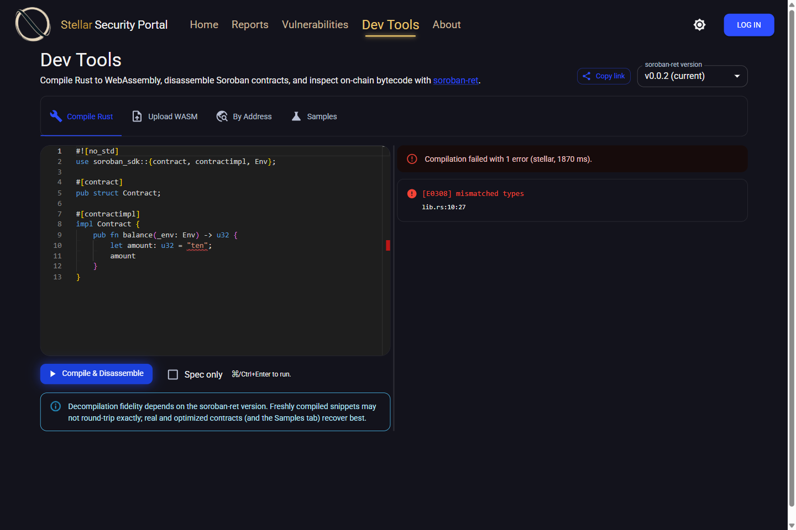
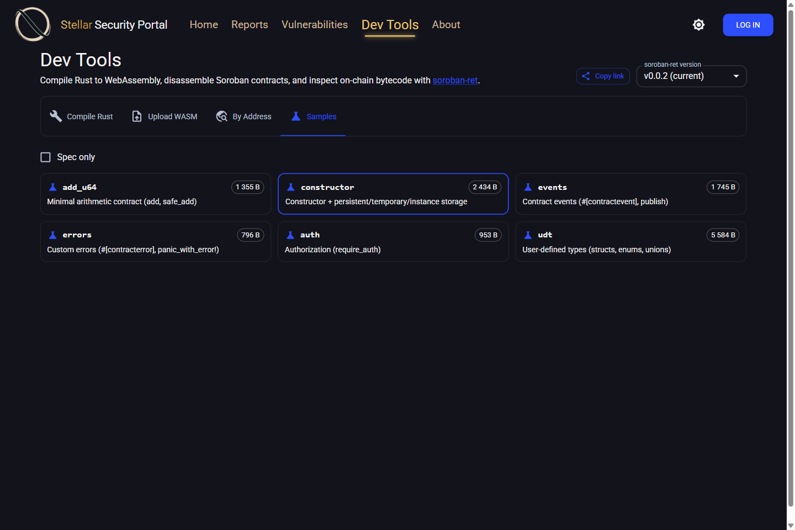
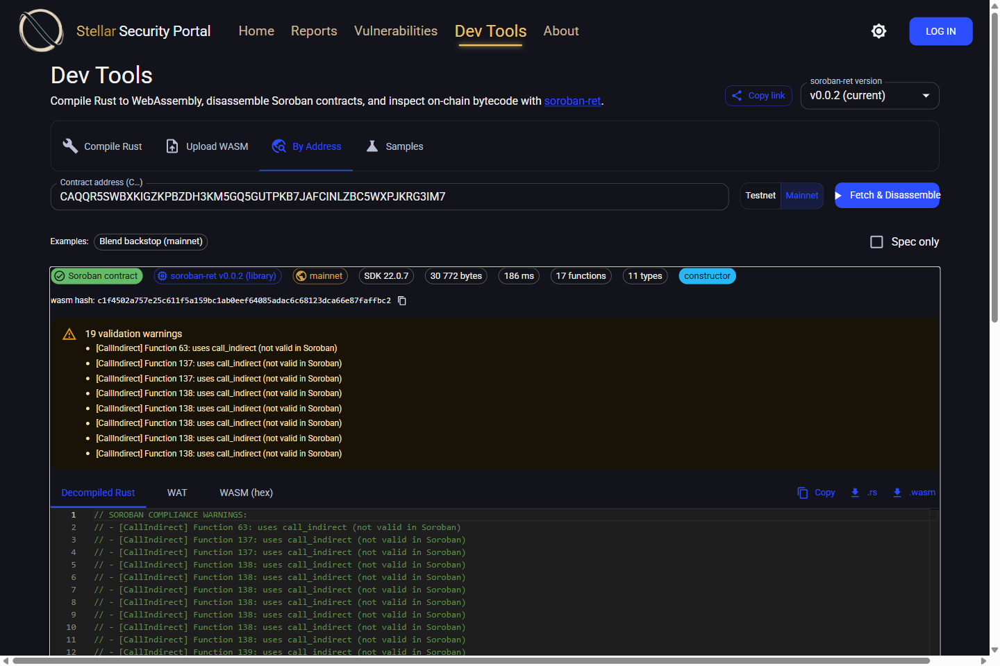
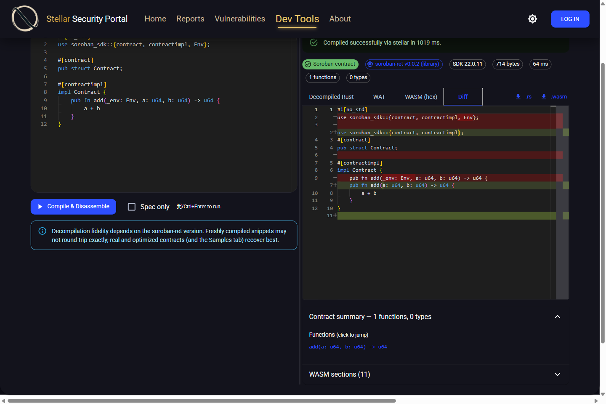

# Dev Tools

This directory implements the **Dev Tools** feature of the Soroban Security Portal
([issue #206](https://github.com/Inferara/soroban-security-portal/issues/206)).

Dev Tools adds a Monaco-editor based page to the portal that integrates the
[`soroban-ret`](https://github.com/Inferara/soroban-ret) reverse-engineering tool:

- shows the current `soroban-ret` version with a dropdown for **version selection**
  — the choice is honored end-to-end (the builtin in-process library, or any
  registered external CLI version; see "Version selection" below);
- lets users write **Rust**, compile it to **WebAssembly** (via the `stellar` CLI
  when available, else `cargo`), and disassemble the result with `soroban-ret`,
  showing **Rust**, **WAT** and **WASM** representations;
- disassembles a WASM module by **contract address** from **Testnet** or **Mainnet**;
- offers a **Samples** tab with built-in contracts that decompile at high fidelity;
- shows a **contract summary** with click-to-jump functions/types, the **WASM
  section** layout, validation warnings, and copy/download;
- mirrors the functionality of the
  [`soroban-decompiler` web frontend](https://github.com/Inferara/soroban-decompiler/tree/main/crates/stellar-decompiler-web/frontend).

## Screenshots

Compile Rust and see errors inline, side-by-side with the result:



One-click sample contracts that decompile at high fidelity:



Disassemble any live contract by address (Testnet/Mainnet), with provenance:



Diff your source against what soroban-ret recovered:



## Architecture

```
┌──────────────────────────────┐        HTTP/JSON (CORS)        ┌──────────────────────────────┐
│  Portal UI (React + Vite)    │  ───────────────────────────▶  │  soroban-ret-web (Rust/Axum) │
│                              │                                │                              │
│  features/.../dev-tools/     │   GET  /api/dev-tools/versions │  • soroban-ret (library)     │
│    dev-tools.tsx  (Monaco)   │   POST /api/dev-tools/compile  │     decompile + WAT          │
│    OutputPanel.tsx           │   POST /api/dev-tools/disasm…  │  • cargo / stellar build     │
│    DiagnosticsList.tsx       │   POST /api/dev-tools/address  │     Rust → wasm32 WASM        │
│  api/dev-tools/…             │                                │  • Stellar RPC client        │
└──────────────────────────────┘                                │     address → on-chain WASM  │
        ▲  window.env.DEVTOOLS_API_URL                           └──────────────────────────────┘
```

The Dev Tools backend is a **standalone service** rather than part of the C#
portal API, because the heavy lifting (the `soroban-ret` decompiler, WAT
generation, XDR/RPC handling, and `cargo`/`stellar` compilation) is all native
Rust — the same design the reference `soroban-decompiler` project uses. The
portal UI talks to it directly over a configurable URL, so the two components
deploy and scale independently.

### Why a separate service (and not the C# backend)?

`soroban-ret` is a Rust library; `wasm_to_wat`, the decompilation pipeline, and
the Stellar XDR/RPC handling have no first-class C# equivalent. Re-implementing
them in the portal API would duplicate a large, fast-moving codebase. Calling the
library in-process from Rust keeps fidelity (exact same output as the CLI) and
lets us bump the `soroban-ret` dependency in one place.

## Components

| Path | What it is |
|------|------------|
| `soroban-ret-web/` | Rust/Axum backend. Depends on `soroban-ret` (crates.io) with the `wasmprinter` feature. |
| `../UI/src/features/pages/regular/dev-tools/` | React page (Monaco editor, mode tabs, output panel, diagnostics). |
| `../UI/src/api/dev-tools/dev-tools-api.ts` | Typed client for the backend. |

### Backend HTTP API (base path `/api/dev-tools`)

All disassembly endpoints accept an optional `version` selecting the engine.

| Method & path | Body | Returns |
|---|---|---|
| `GET /health` | — | `ok` (liveness) |
| `GET /ready` | — | `ready` once the compile cache is warmed, else `503 warming` (readiness) |
| `GET /versions` | — | `{ current, available[], compile_enabled }` |
| `GET /fixtures` | — | `{ fixtures: [{ name, description, size }] }` |
| `POST /disassemble` | `{ wasm_base64 \| wasm_hex, spec_only?, version? }` | disassembly result |
| `POST /disassemble/upload` | multipart `wasm`, `spec_only`, `version` | disassembly result |
| `POST /disassemble/fixture` | `{ name, spec_only?, version? }` | disassembly result |
| `POST /address` | `{ address, network: "testnet"\|"mainnet", spec_only?, version? }` | disassembly result + `wasm_hash` |
| `POST /compile` | `{ source, spec_only?, version? }` | `{ success, diagnostics[], builder, result? }` |

A *disassembly result* contains: `source` (decompiled Rust), `wat`, `wasm_hex`
(section-annotated; truncated for very large modules), `wasm_hex_truncated`,
`wasm_base64`, `wasm_size`, `sections` (WASM section table), `sdk_version`,
`standard_interfaces`, `warnings`, `is_soroban`, `elapsed_ms`, optional
`wasm_hash`, `contract_info` (functions + types with source line numbers), and
`engine` / `engine_version` (which soroban-ret produced the output).

### Version selection

`/versions` returns the builtin library version plus any external CLI versions
registered via `DEVTOOLS_RET_BINARIES` (a `;`-separated `version=path` list):

```text
DEVTOOLS_RET_BINARIES="0.0.1=C:\engines\0.0.1\bin\soroban-ret.exe;0.0.3=/usr/bin/soroban-ret"
```

When a registered version is selected, the service shells out to that binary for
the decompiled Rust (WAT / hex / sections are produced locally and are
version-independent). The builtin version gives the richest output (structured
contract info). Decompilation fidelity depends on the soroban-ret version;
freshly compiled trivial snippets may not round-trip exactly, while the Samples
and real on-chain contracts recover best.

## Running locally

### 1. Backend

Requires a Rust toolchain. For the compile endpoint you also need the wasm32
target (`rustup target add wasm32-unknown-unknown`); without it, disassemble and
address modes still work and `/compile` reports `compile_enabled: false`.

```bash
cd DevTools/soroban-ret-web
cargo run --release
# listens on http://127.0.0.1:8787, pre-warms the compile cache in the background
```

Useful flags / env vars (all overridable):

| Flag / env | Default |
|---|---|
| `--port` / `DEVTOOLS_PORT` | `8787` |
| `--bind` / `DEVTOOLS_BIND` | `127.0.0.1` |
| `--mainnet-rpc` / `DEVTOOLS_MAINNET_RPC` | `https://soroban-rpc.mainnet.stellar.gateway.fm` |
| `--testnet-rpc` / `DEVTOOLS_TESTNET_RPC` | `https://soroban-testnet.stellar.org` |
| `--soroban-sdk-version` / `DEVTOOLS_SOROBAN_SDK_VERSION` | `22.0.8` |
| `--compile-dir` / `DEVTOOLS_COMPILE_DIR` | OS temp dir |
| `--stellar-bin` / `DEVTOOLS_STELLAR_BIN` | (use `stellar` on PATH, else `cargo`) |
| `--no-compile` / `DEVTOOLS_NO_COMPILE` | `false` |
| `DEVTOOLS_RET_BINARIES` | (empty) — `version=path;…` external CLI engines |
| `DEVTOOLS_MAX_CONCURRENCY` | host parallelism — cap on concurrent disassembly jobs |
| `DEVTOOLS_CORS_ALLOW_ORIGINS` | `*` (any) — comma-separated allowlist to restrict CORS |

Builds are serialized (one at a time, shared skeleton project). A failed
`stellar contract build` doesn't emit cargo's JSON diagnostics, so the service
re-runs a fast `cargo check` (against the same target, so its deps are already
warm) to recover precise line/column errors. External CLI engines are bounded by
a 60s timeout and killed on drop. If the startup SDK pre-warm build fails,
`/compile` reports itself unavailable (`compile_enabled: false`) instead of
erroring per request — the other modes keep working.

> The `stellar` CLI builds for the `wasm32v1-none` target — run
> `rustup target add wasm32v1-none` if you point `--stellar-bin` at it. With
> plain `cargo` (the default), `wasm32-unknown-unknown` is used.

### 2. UI

```bash
cd UI
npm install
npm run dev   # http://localhost:5173  → open /dev-tools
```

The UI reads the backend URL from `window.env.DEVTOOLS_API_URL`
(`UI/public/env.js` in dev, `UI/env.template.js` at deploy time). It defaults to
`http://localhost:8787/api/dev-tools` when unset.

### Docker

```bash
docker compose -f DevTools/docker-compose.yml up --build
```

Two image variants (multi-stage targets in `soroban-ret-web/Dockerfile`):

- **full** (default, ~2.8GB): keeps the Rust toolchain + wasm32 target and
  pre-warms the compile skeleton, so `/compile` works and the first build is fast.
- **slim** (`--target runtime-slim`, ~156MB): no toolchain; `DEVTOOLS_NO_COMPILE`
  is baked in. Upload / By-Address / Samples work; Compile mode is disabled.

  ```bash
  docker build --target runtime-slim -t soroban-ret-web:slim DevTools/soroban-ret-web
  ```

Build-arg `PREWARM` (default `true`) controls whether the SDK dependency graph is
baked into the full image. CI's PR builds pass `PREWARM=false` for speed (the
service warms on startup instead, and the `/ready` probe gates traffic until it
finishes). CI publishes both `soroban-ret-web:<tag>` (full) and
`soroban-ret-web:<tag>-slim`.

## Deployment

The service is wired into both deployment paths of the portal:

- **docker-compose**: `Backend/docker-compose.yml` includes a `soroban-ret-web`
  service (with a healthcheck) on the portal network.
- **Helm**: the `Deploy/helm/charts/sorobanretweb` subchart deploys a Deployment +
  ClusterIP Service with liveness/readiness probes. The UI's nginx proxies
  `/devtools/` to it **same-origin** (see `UI/nginx.template.conf`), and the UI
  config map sets `DEVTOOLS_API_URL=/devtools/api/dev-tools` and
  `DEVTOOLS_UPSTREAM=<release>-soroban-ret-web-ip:8787`. `env.template.js` carries
  the `DEVTOOLS_API_URL` placeholder, substituted by `envsubst` at container start.

Notes:
- Same-origin routing avoids cross-origin/CORS; to instead expose the service
  directly, set `DEVTOOLS_API_URL` to its public URL (CORS is permissive).
- The public `gateway.fm` mainnet RPC may rate-limit; point `DEVTOOLS_MAINNET_RPC`
  at your own RPC for production.
- First compile on a fresh deploy builds the SDK (minutes); the nginx `/devtools/`
  location raises proxy timeouts to 600s to accommodate it.
- Set `DEVTOOLS_NO_COMPILE=true` to disable Compile mode (Upload/Address/Samples
  still work; the UI shows an informational notice).
